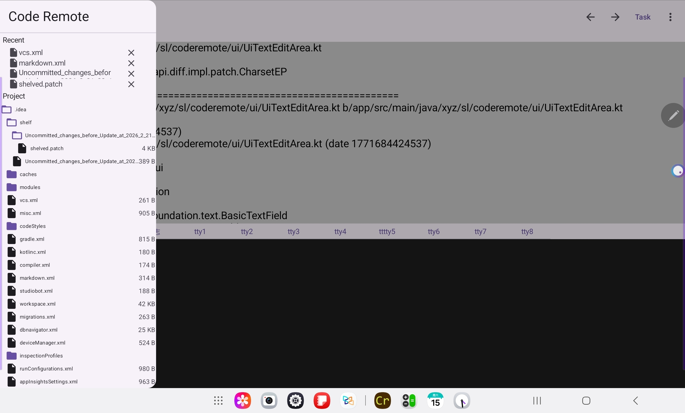

# CodeRemote (Cr)

**CodeRemote** 是一款轻量级远程代码编辑器，支持编辑本地和远程主机项目。当前支持本地项目编辑，正在开发远程编辑功能。

> 更多图片参见 `doc/images`。

---

## ✨ 特性

### 当前功能
- 📁 本地项目浏览与编辑
- 📝 文本编辑器（自动保存）
- 🗂️ 文件树浏览
- 📂 SSH/SFTP 连接的远程文件浏览与编辑

### 开发中
- 📂 打开最近项目
- 🌈 文本高亮
- 🔄 文件缓存与文件后台同步
- 🖥️ 远程 Shell

### 未来计划
- 🛠️ 远程编译
- 🔌 插件支持
- 🤖 接入 Agent
---

## 🚀 快速开始

### 系统要求
- Android 10.0+ (API 29+)

### 安装
下载 App。

### 本地项目使用
1. 启动应用，在文件树中选择项目根目录
2. 点击文件开始编辑
3. 修改自动保存

